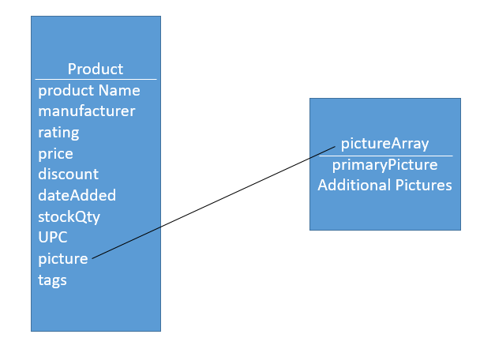
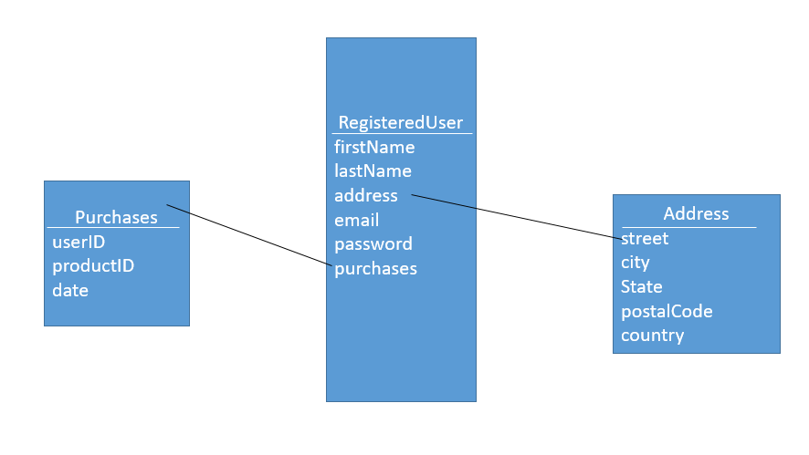

# Schema Planning and Design

For our project we will be focusing on two schemas that will be for the data saved in our database.

Here are some basic UML diagrams representing the setup of the database:

## Product

---

<table>
    <thead>
        <th>Product Properties</th>
    </thead>
    <tbody>
        <tr>
            <td>
                <li>Product Name</li>
                <li>Manufacturer</li>
                <li>Rating (Average on /5 will be displayed)</li>
                <li>Price (Conversion will be automatic)</li>
                <li>Picture(s) (A Primary image will be used as display for the thumbnail)</li>
                <li>Tags (these will be used for the recommendations)</li>
                <li>Date Added</li>
                <li>Number of these items sold (will be used for default recommendations since it'll be based on the highest amount of products sold)</li>
                <li>Stock</li>
                <li>Sale Discount (if > 0%, the product is on sale)</li>
                <li>Product Code (UPC - Universal Product Code)</li>
            </td>
        </tr>
    </tbody>
</table>

The user ratings will be an array of user ratings (an array of objects). That object will contain three properties: the productID for which product is being rated, the rating value and the ID of the user who made it. This object is actually shared with the user. (Now that I look at it, it's missing the date... I'll fix that eventually...)

Additionally, the product schema will also have a helper method/function that will calculate the average value from the array of reviews.

## Registered User

---

<table>
    <thead>
        <th>User Properties</th>
    </thead>
    <tbody>
        <tr>
            <td>
                <li>Username</li>
                <li>Password (hashed & encrypted... obviously)</li>
                <li>Cart</li>
                <li>Email</li>
                <li>Purchases</li>
                <li>Date Added</li>
                <li>Reviews</li>
                <li>Address</li>
                <li>Name</li>
                <li>Phone Number</li>
                <li>Sex (Male, Female or Not Specified)</li>
            </td>
        </tr>
    </tbody>
</table>

After we get the Registered User set up, we can do a similar schema for the employee users.

The registered user schema has two property objects which it is related to: Purchases and Reviews. They will both be arrays of objects. Purchases has the following properties: date, location, price and productID. This is made per product purchased rather than per order which will help if an analytics tool is built for this project. Reviews has: date, productID and rating. It also has a userID property, but I forgot to add it in the diagram.
